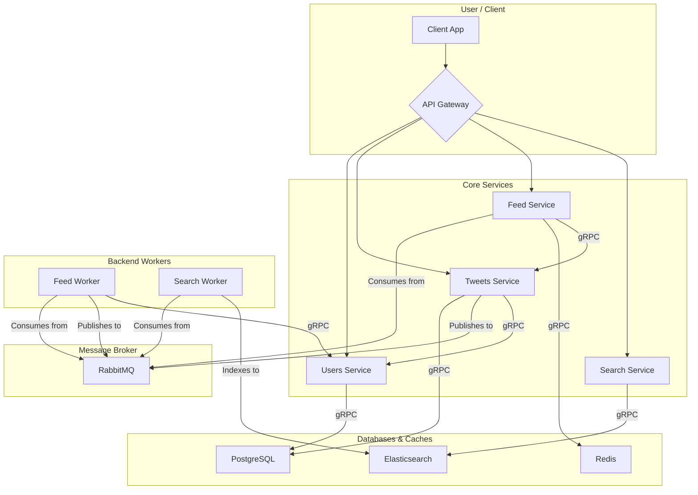

<h1 align="center">🐦 Twitter Microservice Backend Project 🐦</h1>

## 📋 Table of Contents

- [🔍 About](#-about)
- [🏛️ Architecture](#-architecture)
- [🚀 Microservices](#-microservices)
- [🛠️ Key Technologies Used](#-key-technologies-used)
- [🚀 Getting Started](#-getting-started)
- [📖 Documentation](#-documentation)
- [⌚ Future Enhancements](#-future-enhancements)
- [🤝 Contribution](#-contribution)
- [📞 Contact Information](#-contact-information)

## 🔍 About
<p>
    This project is a backend implementation of a Twitter-like application, built using a microservices architecture. Each service is designed to handle a specific domain of functionality, promoting separation of concerns, independent scalability, and maintainability. The system facilitates core Twitter features such as user management, tweeting, following, personalized feeds, and search. Communication between services is achieved through a combination of synchronous gRPC calls for direct interactions and asynchronous messaging via RabbitMQ for event-driven processing and decoupling.
</p>

## 🏛️ Architecture



The application adheres to a microservice architecture with the following key characteristics and components:

* **Microservice Design:** Each service is independently deployable and focuses on a specific business capability (e.g., User management, Tweet handling).
* **Communication Patterns:**
    * **REST APIs:** Client-facing interactions are primarily handled via RESTful APIs exposed by the User, Tweet, Feed, and Search services.
    * **gRPC:** Synchronous, high-performance internal communication between services (e.g., Tweet service calling User service, Feed service calling Tweet service) is handled using gRPC with Protocol Buffers.
    * **Message Queuing (RabbitMQ):** Asynchronous communication for decoupling services and handling background tasks. For instance, the Tweet service publishes events upon new tweet creation, which are consumed by the `tweet-worker` for feed fan-out.
* **Data Management:**
    * **Database per Service:** Each microservice owns its private data store, ensuring loose coupling.
        * **User Service:** PostgreSQL for user profiles, authentication details, and follow relationships.
        * **Tweet Service:** PostgreSQL for tweets, replies, likes, and reposts.
        * **Feed Service:** Redis for caching user-specific feed data (list of tweet IDs/basic info).
        * **Search Service:** Elasticsearch for indexing and searching tweets.
        * **Tweet Worker Service:** Stateless, processes messages.
* **Feed Generation (Fan-out on Write):**
    * The `tweet-worker` service implements a "fan-out on write" strategy. Upon new tweet creation (signaled via RabbitMQ), it fetches the author's followers and pushes the tweet information to individual RabbitMQ queues dedicated to each follower's feed. The Feed service then consumes from these queues.
* **Search Indexing:**
    * The Search service currently uses an **Indexing Worker** that periodically polls the Tweet service's PostgreSQL database to update its Elasticsearch index.
    * **Architectural Note:** Direct database access between microservices is an anti-pattern. A more robust, decoupled solution would involve the Tweet service publishing detailed change events to a message queue, which the Search service's worker would consume to update Elasticsearch (see Search Service README for more details).
* **(Conceptual) API Gateway:** While not explicitly implemented in the provided details, a typical production deployment would include an API Gateway as the single entry point for all client requests. It would handle request routing, rate limiting, cross-cutting concerns like initial authentication, and potentially aggregate responses.
* **(Conceptual) Service Discovery:** For a scalable deployment, a service discovery mechanism (e.g., Consul, Eureka) would allow services to find and communicate with each other without hardcoded addresses. Currently, dependent services use configured addresses.

## 🚀 Microservices

The project is composed of the following core microservices:

* **👤 User Service:**
    * **Responsibilities:** Manages user registration, login, authentication (JWT generation/verification), user profiles, and follow/unfollow relationships. Exposes a gRPC interface for other services to query user data and update user-related counters.
    * **Technologies:** Python, Flask, SQLAlchemy, PostgreSQL, PyJWT, gRPC.
* **📝 Tweet Service:**
    * **Responsibilities:** Handles creation, retrieval, and deletion of tweets, replies, likes, and reposts. Increments/decrements user tweet counts via gRPC calls to the User service. Publishes messages to RabbitMQ upon new tweet creation.
    * **Technologies:** Python, Flask, SQLAlchemy, PostgreSQL, PyJWT, gRPC (client/server), RabbitMQ (Pika producer).
* **📰 Feed Service:**
    * **Responsibilities:** Provides personalized feeds to users. Consumes tweet notifications from user-specific RabbitMQ queues (populated by the `tweet-worker`) and stores feed data in Redis. Serves feed requests, potentially hydrating tweet details via gRPC calls to the Tweet service.
    * **Technologies:** Python, Flask, PyJWT, RabbitMQ (Pika consumer), Redis, gRPC (client).
* **🔍 Search Service:**
    * **Responsibilities:** Provides search functionality over indexed tweet data using Elasticsearch. An Indexing Worker component polls the Tweet service's database to keep the Elasticsearch index updated (with noted caveats).
    * **Technologies:** Python, Flask, Elasticsearch client, Elasticsearch, SQLAlchemy (for worker).
* **👷 Tweet Worker Service:**
    * **Responsibilities:** A background worker that consumes new tweet messages from a RabbitMQ queue (published by the Tweet service). It then fetches the tweet author's followers (via gRPC to User service) and fans out the tweet information by publishing it to dedicated RabbitMQ queues for each follower's feed.
    * **Technologies:** Go, RabbitMQ (AMQP consumer/producer), gRPC (client).

## 🛠️ Key Technologies Used

* **Programming Languages:** Python, Go
* **Web Frameworks:** Flask (Python)
* **Databases:** PostgreSQL, Redis, Elasticsearch
* **ORM/Database Clients:** SQLAlchemy (Python), `psycopg2-binary` (Python), `redis-py` (Python), `elasticsearch-py` (Python)
* **Inter-Service Communication:**
    * gRPC with Protocol Buffers (synchronous)
    * RabbitMQ (asynchronous, using Pika for Python, `amqp091-go` for Go)
* **Authentication:** JSON Web Tokens (JWT) using PyJWT (Python)
* **Containerization (Recommended):** Docker, Docker Compose (for local development and consistent environments)

## 🚀 Getting Started

To get this microservices application running locally, ensure you have Docker and Docker Compose installed. Then, follow these steps:

1.  **Clone the Repository:**
    ```bash
    git clone <your-repository-url>
    cd <your-repository-directory>
    ```
2.  **Configure Environment Variables:**
    *   Create a `.env` file in the root of the project.
    *   You can use the `.env.example` file as a template.
3.  **Run the Application:**
    ```bash
    docker-compose up --build
    ```

This will build and start all the services, including the databases and message broker.

## 📖 Documentation

For detailed information about each microservice, including its specific API endpoints, gRPC interfaces, database schema, and configuration, please refer to their respective README files:

* [👤 User Service](./user-service/README.md)
* [📝 Tweet Service](./tweet-service/README.md)
* [👷 Tweet Worker Service](./tweet-worker-service/README.md)
* [📰 Feed Service](./feed-service/README.md)
* [🔍 Search Service](./search-service/README.md)

*(Note: Replace `./service-name/README.md` with the actual paths to your individual README files.)*

## ⌚ Future Enhancements

Potential areas for future development and improvement include:

* **Notifications Service:** Implement real-time notifications for likes, replies, new followers, etc. (e.g., using WebSockets or Server-Sent Events).
* **Direct Messaging Service:** Add private messaging capabilities between users.
* **Enhanced Search:**
    * Implement user search.
    * Add advanced search filters (date ranges, media type, etc.).
    * Transition search indexing from DB polling to an event-driven approach (e.g., consuming events from RabbitMQ).
* **Media Uploads Service:** Allow users to attach images or videos to tweets.
* **Analytics Service:** Gather and process data for user engagement metrics, trend analysis, etc.
* **Improved Resilience:** Implement circuit breakers, more sophisticated retry mechanisms, and dead-letter queues.
* **API Gateway & Service Discovery:** Integrate an API Gateway (e.g., Kong, Spring Cloud Gateway) and Service Discovery (e.g., Consul, Eureka) for better management in a production environment.
* **Distributed Tracing & Monitoring:** Implement tools like Jaeger, Zipkin, Prometheus, and Grafana for better observability.
* **Security Hardening:** More comprehensive security measures, including input validation, rate limiting, and security scanning.

## 🤝 Contribution

Contributions to this project are welcome! If you'd like to contribute, please follow these general guidelines:

1.  Fork the repository.
2.  Create a new branch for your feature or bug fix (`git checkout -b feature/your-feature-name` or `bugfix/issue-number`).
3.  Make your changes, adhering to the existing coding style and conventions.
4.  Write or update relevant tests for your changes.
5.  Ensure all tests pass.
6.  Commit your changes with clear and descriptive commit messages.
7.  Push your branch to your fork (`git push origin feature/your-feature-name`).
8.  Open a Pull Request against the main repository's `develop` or `main` branch.
9.  Provide a clear description of your changes in the Pull Request.

Please ensure your code is well-documented and that you've updated any relevant README files if your changes impact the service's behavior or setup.

Let's build an awesome microservices application together!

## 📞 Contact Information

If you have any questions, feedback, or need assistance with this project, please feel free to open an issue on the GitHub repository.

---
Happy Coding! 🚀
